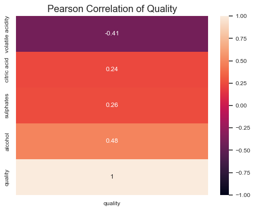
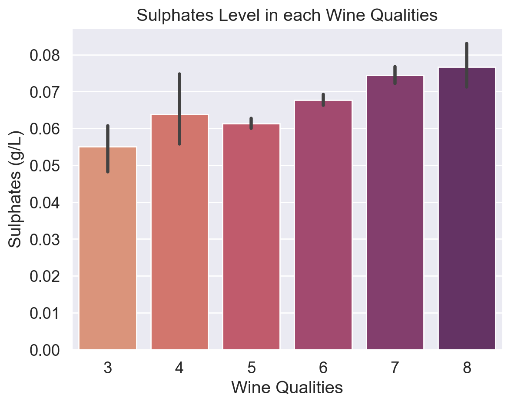
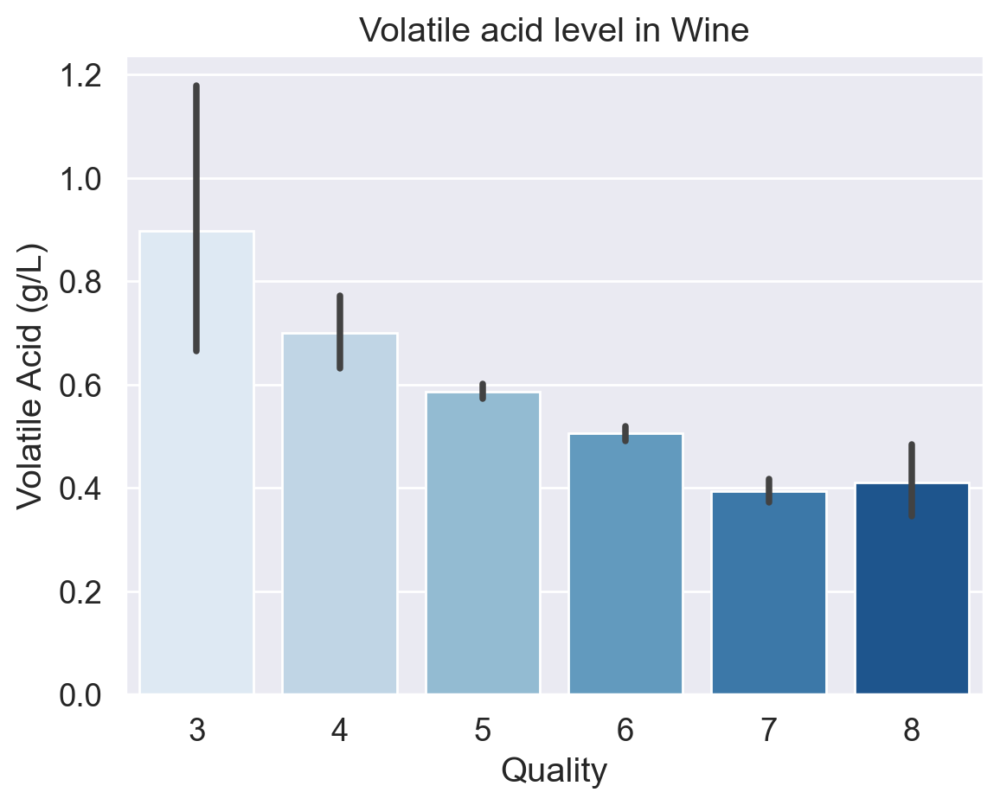
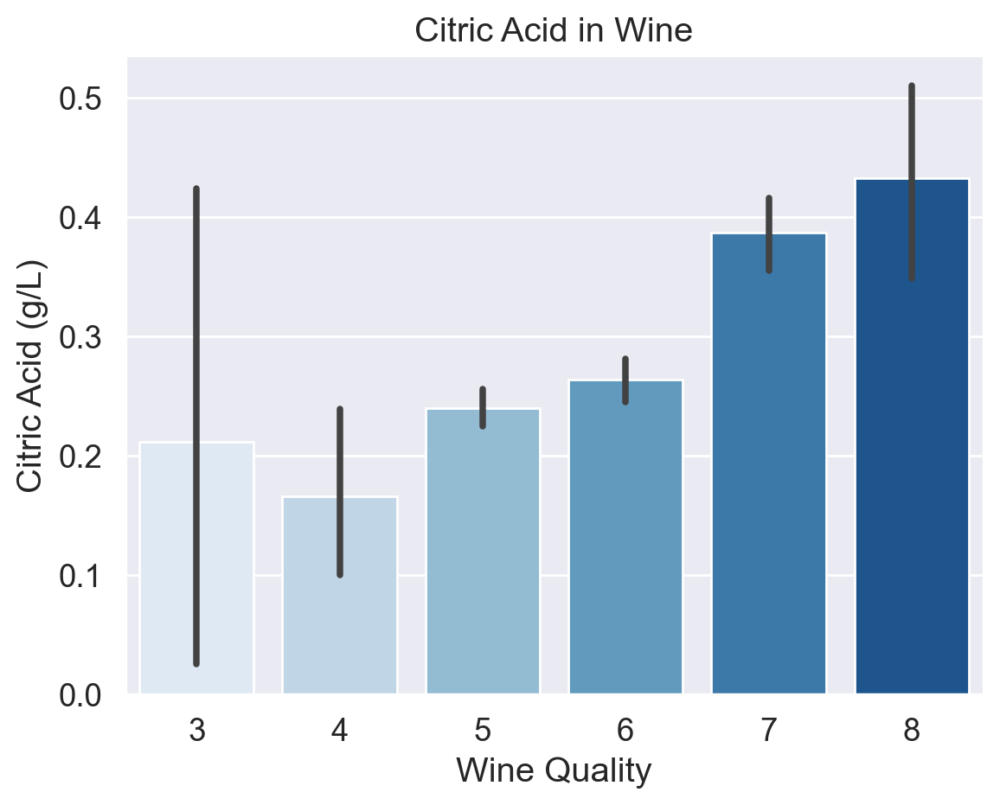
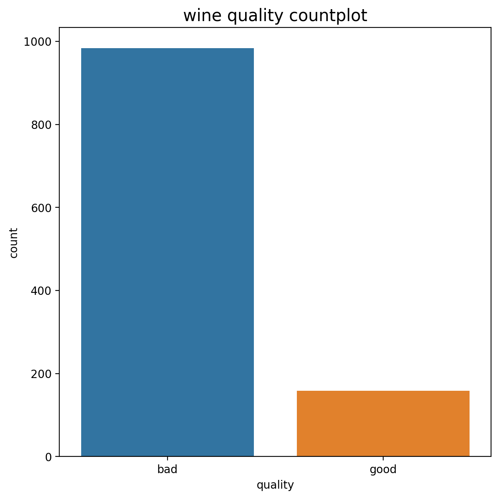
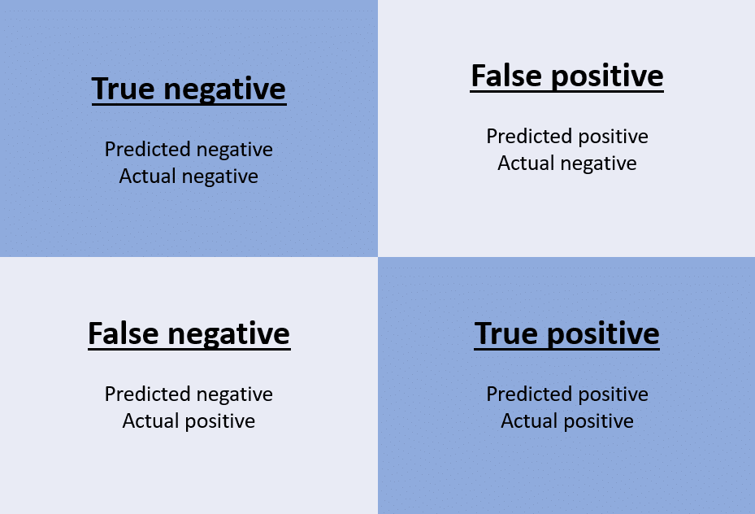

# Wine Quality Analysis


## Table of Content

-[Background](#background)

-[Objective](#objective)

-[Limitation](#limitation)

-[Data Source](#data-sources)

-[Tools](#tools)

-[Exploration Data Analysis](#exploration-data-analysis-eda)

-[Feature Engineering](#feature-engineering)

-[Machine Learning Result](#machine-learning-result)

-[Conclusion](#conclusion)

-[Reference](#references)

-[Appendix A: Feature Explanation](#appendix-a-feature-explanation)

-[Appendix B: Visualization](#appendix-b-visualization)

-[Appendix C: Build a machine learning](#-appendix-c-build-a-machine-learning)

---


## Background

This wine data aims to provide business insight to wine company. By analyzing a few of chemical aspects data, we seek to identify trends, and gain deep understanding of the quality of wine. The problem of the wine nowadays is the production rate of wine is not as massive as before and it will continously drop in the future due to several external influence such as climate change and pandemic.

## Objective
The objectives about this project is to explore the data and create a prediction of quality of wine.

## Limitations

There are some limitations of this analysis:

1. The data that we processed is quite small and it makes the accuracy of the prediction is quetionable. The wine expert opinion is needed to create more accurate prediction.

2. There are a few outliers that cannot be dropped due to the smaller of data, the worse the prediction is.

3. The imbalance of wine data creates suboptimal machine learning performance.

## Data Sources

The dataset gathered from University of California Irvine (UCl) Machine Learning Repository or Kaggle. It contains chemical information that related to wine. The data have about 1000 indexes and 10 features. Here we create a table of brief definition of each feature.

|Columns|Description|
|---|---|
|Alcohol|a product of the grape-yeast post-fermentaion. Usually measure in %.|
|Volatile Acidity| a measure of the wine's volatile (or gaseous) acids.|
|Fixed Acidity| Influences the flavor of the wine. A significant reduction in acids can lead to wines that taste flat.|
|Citric Acid| an antimicrobial to prevent the growth of bacteria and fungi.|
|Residual Sugar|The sugar left inside a wine after fermentation.|
|Free Sulfur Dioxide|The amount of sulfur dioxide (SO2) in free form.|
|Total Sulfur Dioxide|The amount of SO2 in total. This chemical added to protect wine against oxidation, which can affect the color and taste of wine.|
|Density|adfa|
|pH|a measure how acid or base the chemical substance.|
|sulphates|a food preservative to maintain the wine flvaorness and freshness.|
|Quality|describe the quality of wine on scale 0 (very poor) to 10 (very good).|

## Tools

The tools were using to analyze is:

- Seaborn

- Matplotlib

- Scikit Learn

- Pandas

## Exploratory Data Analysis (EDA)

### Psychochemical Substance based on Quality

This subpage dedicated to discuss about the most important psychochemical substance that can determine the high or low quality.

<p align = 'center'>

</p>

- This project uses Pearson correlation to determine the influence of the ’Quality’ label on other features with a value range of -1 to 1. Based on Figure 2.1, there are four features that have a large correlation with the ’Quality’ label. Pearson Correlation is statistical measure that used to find out strength of the relationship between two variables which represented by its coefficient r. The coefficient can be expressed as

    $$r = \frac{\sum_{i = 1}^{p} (x_i - \bar{x})(y_i - \bar{y})}{\sqrt{\sum_{i = 1}^{p} (x_i - \bar{x})^2 (y_i - \bar{y})^2}}$$

    where $x_i$ is the value of i-th index in the feature, $\bar{x}$ is the feature mean, $y_i$ is the value of the label at i-th index, dan $\bar{y}$ is the mean of the label.


<p align = 'center'>

</p>

- **Alcohol** Alcohol is a byproduct formed from fermentation. Yeast ’eat’ the the sugar from grape and then produces alcohol and carbon dioxide. Alcohol content is calculated based on the percentage of ABV (Alcohol By Volume) or the ratio of alcohol content to the total volume of wine. The ABV range in wine is from 5.5% to 17% (Grainger, 2021).

- **Alcohol** in wine plays a crucial role in terms of taste, aroma, preservation, and the experience it offers to the connoisseur. This compound gives texture, mouthfeel, and color thickness to wine. The higher the content, the more intense the color.


<p align = 'center'>

</p>

- **Sulphates** has a correlation coefficient score that is almost as large as citric acid. It creates stability so that the wine remains durable. Sulfites are formed naturally during the fermentation process. Winemaker see it as additional substarate, they add it if necessary. Based on the figure above, the sulfit content in the data ranges from 0.05 g/L to 0.075 g/L. According to Winefolly, several countries such as US have made regulations regarding the sulfite content in wine that max allowed is 0.35 g/L.

- However, the mean value of Sulphates is 0.66. This value is too large when compared to the wine regulation in several countries. The data source does not provide the information regarding the unit they used.

<p align = 'center'>

</p>

- **Volatile Acidity** represent the volatile acid content contained in the wine. This acid is gaseous, which produces a certain smell due to the collection of acids mixed in the wine. 

- **Volatile (gaseous) acids** are a group of acids that can be detected by inhaling them, because these acids are in the form of vapor. This acid is also found in vinegar. Volatile acid in wine is expressed in grams/liter or g/L (there is 1 gram of volatile acid in 1 liter of wine).

- Based on the figure above illustrates that the higher the quality, the
lower the acid. 

<p align = 'center'>

</p>

- **Citric Acid** is a weak organic acid that is usually used as a natural preservative or additive to food or drinks to enhance the sour taste, while sulphates (sulfites) are preservatives to maintain the freshness and taste of the wine. (European Food Information Council, 2018). 

- If we refer to the barplot above, the citric acid content increases with increasing quality number. However, Wine with quality number 3 has a higher citric acid content than wine with quality number 4. This is an anomaly because the data in quality 3 has outliers, so the mean value of the barplot is higher than quality 4.

## Feature Engineering

Feature engineering is the process of selecting, manipulating, and transforming raw data into usable features.

### Label Modification

- The quality column have variety of wine quality (from 3 to 8). So, in this experiment, we change it to 0 for low quality (3 to 6.5) and high quality (above 6.5) of wine. the result can be seen in figure below. 

<p align = center>

</p>

### Standardization

- Some features have different scales, some even have three digits. This can affect the accuracy of the model. Therefore, scaling needs to be done even though this is not mandatory. In this experiment, the standardization used is Z-score (Standard Scaler). The Z-score is 

$$X_{new} = \frac{X_i - \mu}{\sigma}$$

with $X_{new}$ represents after-scaling features, $X_i$ is the i-th index of the feature, $μ$ is the mean of the feature, and σ is standard deviation.

### Machine Learning Result

- Metrics are quantitative benchmarks used to evaluate the effectiveness of a machine learning model.

- Confusion Matrix is a table used to evaluate the performance of a classification model in a machine learning. The key component of this benchmark can be seen figure below

<p align = center>

</p>

- True Negative (TN) is number of correctly predicted negative cases, while True Positive (TP) is the total of positive cases that correctly predicted by machine learning.

- False Positive (FP) is number of incorrectly predicted positive cases (Type I error), while False Negative (FN) is total of incorrectly predicted negative cases (Type II error).

- Accuracy is metric that measures how precise the predictions produced by a machine learning model are. The equation of accuracy is

    $$accuracy = \frac{Correct\space Prediction}{All\space Prediction} = \frac{TN + TP}{TN + TP + FN + FP}$$

- Recall is a benchmark metric for how often a machine learning model correctly guesses a True Positive (TP) from all actual positive samples in the dataset. The formulat that represent this metric is

    $$recall = \frac{TP}{TP + FN}$$


### Conclusion

The analysis results are summarized as follows:

1. There are 4 psychochemicals that needs to be considered  to make high or low quality wine, which is `alcohol`, `volatile acidity`, `sulphates`, and `citric acid`.

2. `Alcohol`, `citric acid`, and `sulphates` has a positive correlation to the quality of wine, whereas `volatile acidity` has the opposite.

3. The machine learning classification model could distinguish between low and high quality wine with 89% accuracy. 

### Recommendation

Based on an analysis, we recommend that:

1. For wine factory and distributors, the wine quality and target market need to be decided before produce a wine. For instance, Increase production of low quality wines. If the amount of wine available is abundant in the market at a relatively affordable price, people of any economic class are interested in buying it, either for drinking or as a cooking ingredient.

2. `Alcohol`, `sulphate`, and `citric acid` has **positive correlation** to the wine quality. It means that the wine will upgrade if both chemicals added. However, the `volatile acidity` downgrades the quality. This acid should be distilled out from a wine after fermentation process.  

3. We suggest to add size and some features such as the price of the wine and age of the wine to create more, new insight, recommendations, and accurate prediction. 


### Refrences

- [Puckette,  Madeline.  What  is  Residual  Sugar  in  Wine?.2020.](https://winefolly.com/deep-dive/what-is-residual-sugar-in-wine/)

- [Howard,  Cathy.  What  is  Residual  Sugar  in  Wine?.](https://whicherridge.com.au/blog/what-is-residual-sugar-in-wine/#:~:text=The%20residual%20sugar%20remaining%20in,0.3%20to%202%20g%)

- [Nierman, Doug. Acidity is a fundamental property of wine, imparting sourness and resistance  to  microbial  infection.  2004.](https://waterhouse.ucdavis.edu/whats-in-wine/fixed-acidity#:~:text=The%20predominant%20fixed%20acids%20found,2%2C000%20mg%2FL%20succinic%20acid)

- Iland, Patrick. Monitoring the Winemaking Process from Grapes to Wine: Techniques and Concepts. 2014

- Jacobson, Jeal. N, Introduction to Wine Laboratory and Procedures.2016. ISBN:0-387-24377-1 

- Bartowsky, E.J., Henschke, P.A., “The ‘buttery’ attribute of wine-diacetyl-desirability, spoilage and beyond. 2004. Int. J. of Food Microbiology 96: 235-255.

- Boulton, R.B., Singleton,. V., Bisson, L., and Kunkee, R., Principles and Practices of Winemaking. 1996 Chapman & Hall, New York.

- Lui, S. Q. Malolactic fermentation in wine – beyond deacidification.  2001. Journal of Applied Microbiology 2002, 92, 589–601.

### Appendix A: Flowchart


### Appendix B: Visualization

```python
# Create Correlation using Heatmap
fig = plt.figure(figsize=(8,9))
sns.heatmap(data = df.drop('Id', axis =1).corr(), cmap = 'RdYlBu', annot=True)
fig.tight_layout()
plt.savefig('correlation data', dpi = 300)
```


```python
fig = plt.figure(figsize = (7,7))
sns.countplot(df2, x = df2['quality'])
```

### Appendix C: ML model Result

```python
# Evaluate Random Forest Classifier Model
from sklearn.metrics import accuracy_score, confusion_matrix, classification_report
def evaluation_score (test_var, prediction = rfc.predict(X_tst_sc)):
    rfc_acc = accuracy_score(test_var, prediction)
    conf_mat = confusion_matrix(test_var, prediction)
    plt.figure(figsize = (4,4))
    sns.heatmap(conf_mat, annot = True)
    print(f'accuracy score of Random Forest Classifier model is {rfc_acc}')
    print(classification_report(test_var, prediction))

evaluation_score()
```

